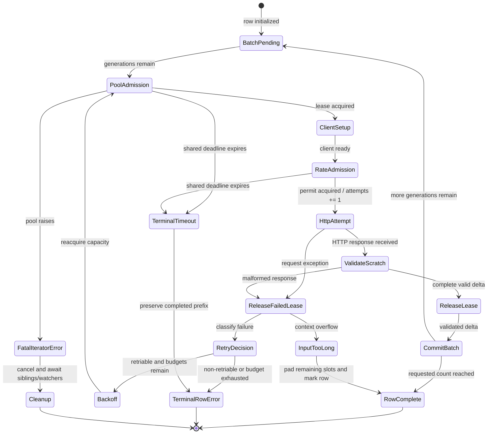

# External retry policy

External model configuration accepts an optional `retry_policy`:

```yaml
external_model:
  base_name: gpt-4o
  base_url: https://api.openai.com/v1
  api_key_env: OPENAI_API_KEY
  requests_per_minute: 500
  retry_policy:
    max_attempts: 4
    request_timeout_seconds: 120
    total_deadline_seconds: 300
    initial_backoff_seconds: 1
    max_backoff_seconds: 30
    jitter: full
```

The defaults are four attempts, a 7,200-second request timeout, a 7,200-second
total deadline, one second of initial backoff, and 60 seconds of maximum
backoff. Model YAML request timeouts and total deadlines are capped at 7,200
seconds, and both backoff fields are capped at 60 seconds. An explicit
command-line total-deadline override has no fixed upper ceiling, but it must
be finite and greater than 7,200 seconds. This also makes it greater than every
request-timeout and backoff value allowed in model configuration.

Pass `--external-total-deadline-seconds VALUE` to either scheduler command to
replace `total_deadline_seconds` for every external candidate model used by
that run, including models restored from the scheduler database. The
command-line value takes precedence over model YAML and persisted values.
Omitting the flag preserves each model's configured or persisted value, or the
7,200-second default.

`max_attempts` must be a native integer from 1 through 100. Timing values must
be native finite integers or floats; booleans and numeric strings are rejected.
Timeouts must be positive, initial backoff may be zero, and maximum backoff
cannot be smaller than initial backoff.

`jitter` controls how the retry delay is sampled. `full` samples between zero
and the capped exponential backoff. `equal` preserves half of that cap and
samples the other half. `decorrelated` samples between the initial backoff and
three times the previous sampled delay, capped by `max_backoff_seconds`. The
default is `full`; any other value is rejected.

These checks happen before Pydantic can coerce YAML values. Retry budgets are
safety limits, so accepting `true` as `1` or `"30"` as `30` would make a typo
silently change endpoint traffic.

The validated policy object is immutable. Replace the whole policy with a new
validated value instead of mutating individual fields, so request-budget
limits cannot drift after configuration validation.

The strict integer checks for `requests_per_minute` and
`max_simultaneous_requests` apply to external models. Local and remote model
configs retain their established Pydantic integer-coercion behavior; this
external-policy layer does not change their input contract.

The effective policy is copied onto the runtime model and persisted as JSON in
`models.external_retry_policy`. Upserts replace it, legacy `NULL` rows hydrate
the documented defaults, and startup migration adds the column to older
databases. Migration ignores only SQLite's expected duplicate-column error;
other schema or storage failures still abort startup.

This layer defines and preserves the policy contract. The stacked request
layers apply it to HTTP admission, retry accounting, response validation, and
external judge calls. Keeping persistence first means every later request path
consumes one validated, resumable policy instead of inventing local defaults.

## Shared request kernel

`ExternalRequestRunner` is the common enforcement primitive used by the
dependent generation, choice-scoring, and judge integrations. One logical
operation has a single total deadline, while each HTTP attempt receives a fresh
`request_timeout_seconds` budget capped by the time remaining.

The admission order is deliberate:

1. acquire an in-flight pool lease;
2. prepare the endpoint client;
3. acquire the shared provider-rate permit;
4. increment the attempt count and start HTTP;
5. release the lease before retry backoff.

Pool waits, client setup, and provider-rate waits consume the total deadline,
but not an HTTP attempt or per-attempt timeout. A setup failure is terminal
`client_setup_failed` evidence with `attempts=0`; a rate-admission timeout also
reports zero attempts. A provider permit reserved successfully but left unused
because the total deadline expires before dispatch is refunded before the
request fails. Admission completion transfers ownership cancellation-safely:
if cancellation wins after a pool lease or provider permit has been reserved
but before the caller records it, the untransferred lease is released or the
permit is refunded before cancellation propagates.

Endpoint and quota identities are process-scoped. Equivalent URL spellings
share one canonical endpoint, and quota keys combine that endpoint with a
SHA-256 credential fingerprint rather than the raw key. Conflicting live pool
capacity or RPM registrations fail instead of silently inheriting the first
value.

This kernel does not by itself reroute every existing caller. The next stacked
PRs integrate it transactionally with registration, ordinary generation,
choice scoring, and external judges, each with caller-specific response
validation.

## Atomic registration

External pools and quota limiters live for the scheduler process lifetime, so a
logical model name is an immutable runtime identity. Re-registering the exact
same effective configuration is idempotent, including after its model/task
events have completed. Eval360 persists a canonical snapshot containing every
`ModelInstance` field; credential and other recognized secret values are stored
as SHA-256 fingerprints in that snapshot. Any same-name field change fails
before persistence or registry mutation. Building the snapshot from the typed
model means newly added runtime fields inherit this immutability contract
automatically. Restart the scheduler to replace a policy intentionally.

Registration holds one scheduler lock across pure conflict preflight, resource
installation, database writes, and event creation. Hugging Face task resolution
and record-count validation also finish before judge resources or durable task
state are installed. Model, judge, task, and event rows use a SQLite savepoint.
Queue publication is deferred until that savepoint commits, so work cannot
start against rows that later roll back.

If persistence, event creation, or cancellation fails, the savepoint is rolled
back and only the pool, endpoint membership, or limiter created by that call is
removed. Pre-existing resources shared by another alias are preserved by
object-identity checks. This ownership boundary prevents one failed
registration from tearing down a successful concurrent or earlier registration.

## Ordinary generation transaction

Ordinary external completion and chat requests use the shared request kernel
for every batch. Pool acquisition and client construction happen before a
provider-rate permit or HTTP attempt is charged. Each retry reacquires capacity,
and the lease is released before backoff, so a failing request cannot starve an
unrelated prompt.

The transaction boundary is one provider response, not the entire logical row.
Eval360 validates one batch into a scratch delta and commits that delta in one
step. A rejected attempt therefore changes nothing, but a successfully
committed earlier batch remains visible if a later batch fails. The retry
attempt limit applies independently to each batch; `total_deadline_seconds` is
shared by every batch needed to finish the row.

An HTTP 2xx response is not committed merely because the SDK returned an
object. Eval360 first requires:

- exactly the requested number of choices;
- native integer indices containing every value from zero through `n - 1`
  exactly once;
- string completion text, or valid chat content;
- consistent logprobs presence across parallel choices; and
- strict-JSON metadata for the entire response.

Valid out-of-order choices are sorted by index. Invalid, duplicate, missing, or
boolean indices are classified as `malformed_response` and retried within the
configured policy. Finish and stop reasons are type-checked; usage, logprobs,
and tool calls use SDK JSON-mode dumps; malformed present reasoning or tool
metadata is rejected; and the whole delta must pass `json.dumps` with non-finite
numbers disabled. Parsing happens into a scratch delta, so a malformed attempt
cannot leak text, metadata, usage, finish reasons, reasoning, tool calls, or
logprobs into the output. Commit is also transactional with respect to
input-owned keys: Eval360 applies the delta to a copy and swaps it into the
result only after every destination accepts its values. If a later batch
exhausts its retries, the earlier completed batch remains in the error artifact.

### Corner cases

The following cases are intentional parts of the ordinary-generation contract:

| Case | Behavior and rationale |
| --- | --- |
| Choices arrive out of order | Native integer indices are treated as identity. A complete permutation of `0..n-1` is sorted before parsing, so provider ordering does not affect output ordering. |
| An index is missing, duplicated, out of range, non-integer, or a boolean | The entire provider response for this batch is rejected as `malformed_response`. Python booleans are rejected even though `bool` is an `int` subclass. No choice or metadata from the response is committed. |
| Choice count differs from the requested `n` | The response is `malformed_response`, even if the choices that did arrive look valid. This prevents silent under-generation or over-generation. |
| Completion `text` is not a string | The entire provider response for this batch is rejected as `malformed_response`. Empty completion strings remain valid strings. |
| Chat `content` is an empty string | The response remains valid. Eval360 preserves the existing generation behavior: when non-empty reasoning is present, it becomes the generation text and is also retained in `reasoning`; otherwise the generation remains an empty string. |
| Chat `content` contains only whitespace | The response remains valid and the whitespace is retained exactly. Reasoning metadata does not replace whitespace content. |
| Chat `content` is `null` | The response remains valid only when the generation has a terminal `finish_reason` of `stop` or `length`. Eval360 records an empty generation and retains reasoning separately when present. A different finish reason makes the response `malformed_response`. |
| Logprobs appear on only some choices in a batch | The entire provider response for this batch is rejected as malformed. Logprobs must be present for every parallel choice or for none. |
| Logprobs presence changes between batches for one row | The later batch is malformed and retried. A completed row therefore has logprobs for every generation or has no `logprobs` field. |
| Optional per-choice metadata appears only in some choices or batches | `finish_reasons`, `reasoning`, and `tool_calls` are padded with `null` so each retained field stays parallel to `generations`. `generation_metadata` always has one entry per committed choice. `response_usage` is different: it is per provider response, not per choice. |
| Usage, logprobs, tool calls, reasoning, finish reasons, or stop reasons have invalid types | The entire provider response for this batch is rejected as malformed. SDK objects must dump to JSON mappings, `finish_reason` must be a string or `null`, and `stop_reason` must be a native string, integer, or `null`. |
| Metadata contains `NaN`, infinity, or another non-JSON value | Strict serialization of the complete scratch delta fails, so the attempt is malformed and nothing is committed. |
| An input row already owns an output key with an incompatible value | Commit is attempted on a deep copy and fails without changing the original result. The row becomes a legacy exception result; because this is a local contract conflict rather than an external request classification, it does not receive an `eval360_error.code`. |
| A later batch fails after an earlier batch committed | The result is an exception artifact containing the completed prefix. This is the expected batch-transaction boundary, not a partial write from the failed attempt. |
| The row deadline expires between batches | No new HTTP attempt starts, so the terminal `request_timeout` can report `attempts: 0` for that batch while preserving the earlier committed prefix. |
| Context overflow occurs after earlier batches | The error is not retried. Earlier generations remain, remaining generation slots become empty strings, retained per-choice metadata is padded with `null`, and `eval360_input_too_long` is set. |
| Cancellation races with pool or rate admission | An acquired-but-untransferred pool lease is released and an unused provider permit is refunded. Iterator cleanup cancels and awaits request and watcher tasks. |

### Exceptions and terminal signals

`attempts` counts HTTP calls that actually started. Pool waits, client setup,
rate-limit waits, and a deadline noticed before dispatch do not increment it.
`retriable` describes the classification; a value of `true` does not promise
another attempt when the attempt limit or total deadline has already been
exhausted.

| Exception or signal | How it occurs | Classification and handling | Meaning |
| --- | --- | --- | --- |
| `MalformedExternalResponseError`, `APIResponseValidationError`, or `JSONDecodeError` | A successful HTTP response violates choice identity, content, metadata, logprobs, or strict-JSON requirements; the SDK may also reject or fail to decode the payload. | `malformed_response`; retried while budget remains. | The endpoint responded, but the payload cannot be safely represented as the requested generation batch. |
| `APITimeoutError`, `httpx.TimeoutException`, or `asyncio.TimeoutError` | An HTTP attempt exceeds its request budget, or pool/rate admission or the logical operation exceeds the shared deadline. HTTP 408 maps here too. | `request_timeout`; retried while budget remains. Admission/deadline failures before dispatch may have `attempts: 0`. | The operation did not finish within its applicable time budget. |
| HTTP 429 status error | The provider rejects the request because of quota or rate pressure. | `rate_limited`; retried while budget remains. | Provider-side admission throttled the request; this is distinct from waiting for Eval360's local rate permit. |
| HTTP 5xx status error | The provider reports a server-side failure. | `backend_5xx`; retried while budget remains. | The endpoint was reached but failed transiently on the provider side. |
| Other HTTP 4xx status error | The provider rejects the request, excluding the context-overflow special case below. | `backend_4xx`; terminal with `retriable: false`. | The request is considered invalid or unauthorized and repeating it unchanged is not expected to help. |
| Connection and remaining transport errors | The SDK, `httpx`, or `aiohttp` cannot complete a request and no more specific status classification applies. | `endpoint_unreachable`; retried while budget remains. | No usable provider response was obtained. |
| Client setup exception | Constructing or selecting the endpoint client fails after pool admission but before rate admission. | `client_setup_failed`; terminal, `retriable: false`, `attempts: 0`; the pool lease is released and no provider permit is consumed. | Local endpoint-client preparation failed, so no HTTP request was sent. |
| Context-length `BadRequestError` | The provider code is `context_length_exceeded`, or its message identifies maximum/context length overflow. | Normal row result, not `eval360_error`: no retry, empty strings for remaining generations, and `eval360_input_too_long: true`. | The input is permanently too large for this model; the evaluation continues with an explicit row marker. |
| Pool acquisition exception | The process-scoped connection pool itself raises rather than waiting or returning a lease. | The original exception escapes the row, the iterator fails, and sibling/watcher tasks are cancelled and awaited. | This is a fatal local orchestration failure, not evidence about one provider response. |
| `asyncio.CancelledError` | The run or generation connection is cancelled during admission, HTTP, or iteration. | Cancellation propagates after owned leases and permits are cleaned up. Configured cancellation-with-failures may emit exception rows for unfinished prompts. | Work was intentionally interrupted; it is not classified as an endpoint failure. |

Terminal classified failures are first held in `ExceptionWrapper`. When the
scheduler writes the row, it preserves the legacy `exception` and `trace`
fields and also adds stable evidence of this form:

```json
{
  "eval360_error": {
    "code": "backend_5xx",
    "attempts": 3,
    "elapsed_seconds": 12.4,
    "retriable": true,
    "http_status": 503
  }
}
```

Absent values, such as `http_status` for a transport failure, are omitted.

### State machine

Each ordinary completion or chat row moves through the following states. The
pool lease exists from `Pool admission` through scratch validation; it is
released before either backoff or commit. Response validation happens inside
the retry attempt, while commit happens only after the runner returns a complete
scratch delta.



In prose: a row repeatedly admits one capacity-sized batch, sends one HTTP
attempt, validates the response into scratch state, and commits it. A retryable
failure returns to admission after backoff and therefore obtains fresh pool
capacity. A terminal classified failure produces a row error with any
previously committed prefix. Context overflow instead completes the row with a
marker. A pool/orchestration failure aborts the iterator and enters shared task
cleanup.

External judges have a separate fan-out lifecycle, described below.

## Choice-scoring transaction

External choice scoring makes two logical phases: full prompts and
completion-only prompts. Both phases share the row's total deadline, but every
HTTP operation gets its own bounded attempt loop, provider-rate admission, and
pool lease. Neither phase writes output fields until both phases have completed
successfully, so cancellation or terminal failure cannot leave half of a score.

Successful responses are validated inside the retry attempt. Eval360 requires
exact choice identities, a logprob payload for every choice, aligned and ordered
offsets when present, and at least one finite numeric completion-suffix logprob.
Live parsing is deliberately strict: booleans, non-finite values, and numeric
strings—including strings nested in provider dict/object token records—are
malformed responses. The grader's persisted-artifact reader remains tolerant of
historical numeric strings. Keeping those modes explicit prevents compatibility
behavior from weakening new provider responses.

For provider compatibility, choice requests use `echo=true` with
`max_tokens=1`, so a response can contain zero or one generated token. If a
response omits offsets (including an empty offset list), Eval360 uses returned
text plus strict `usage.completion_tokens` evidence to prove that zero-or-one
tail, excludes it before selecting the row's declared suffix token count, and
records the exclusion in the raw logprob payload. Ambiguous or multi-token tail
evidence is rejected. The grader therefore uses the echoed prompt suffix after
restart instead of accidentally scoring generated output. Unmarked historical
payloads keep their legacy interpretation. Response logprobs, usage, and choice
metadata are JSON-mode normalized and strict-JSON checked inside the attempt
boundary.

Some vLLM-compatible endpoints return a malformed MessagePack error for batched
prompt lists. That specific batched error narrows the operation to one prompt
per choice. Each fallback call still uses the configured retry policy and the
same strict response validator; a terminal single-prompt MessagePack failure is
reported as `malformed_response` rather than triggering an unbounded outer loop.

Choice rows may omit precomputed token counts only when usable offsets identify
the suffix. Supplied counts must be positive integral non-booleans. Exact
integer floats and numeric strings are normalized only because existing
artifacts may contain them; fractions and non-finite counts fail before HTTP.
Context overflow remains a one-attempt normal result with
`eval360_input_too_long: true`, and subsequent rows continue.

## External judge requests

External LLM-as-judge chat and completion calls use a narrow `AsyncOpenAI`
proxy backed by the shared request kernel. Local vLLM judges still wait for the
job manager and retain their existing request path.

The external proxy canonicalizes the judge endpoint before constructing either
the SDK client or its pool admission callback. A judge and generation model
with equivalent endpoint aliases therefore share the same serving-capacity
pool. Their endpoint and credential fingerprint also select the same provider
rate limiter. Each provider attempt independently:

1. acquires one shared serving-capacity lease;
2. acquires one shared provider-rate permit;
3. performs the SDK request within the configured request timeout; and
4. returns the lease before retry backoff or during cancellation cleanup.

The client is constructed before this sequence, so local setup cannot consume
a provider permit or increment the HTTP attempt count. SDK retries remain
disabled; the application policy is the only retry owner.

A successful HTTP response remains inside the retry boundary until it contains
exactly the requested number of choices and every judge result has non-empty
chat content or completion text. SDK validation failures, JSON decode failures,
and these malformed-success cases consume one real provider attempt and may
retry within the same bounded policy. Exhaustion produces the same structured
failure evidence as generation.

The math-verify and sympy graders retain their historical three-call fallback
for local or unclassified failures. They re-raise `ExternalRequestFailure`
immediately because that exception represents an already-exhausted policy;
retrying it in the fallback would multiply the configured attempt limit.

Both sequential and concurrent grading paths use
`ExceptionWrapper.from_exception`, including for nested `ExceptionGroup`
failures. The scheduler writes the resulting `eval360_error` metadata beside
the legacy exception and trace fields. Closing the concurrent grading iterator
cancels and awaits its reader and unyielded grading tasks, preventing a judge
request or capacity lease from surviving its consumer. A grading child that
raises `CancelledError` publishes that terminal state to the ordered consumer
before exiting; the consumer propagates cancellation at that row instead of
waiting forever on a queue that can no longer receive a result.

Concurrent grader overrides must preserve the base
`_grading_generator(start=..., skip_rows=...)` contract. In particular,
MathVerify forwards both values to the nonblocking generator so resumed runs
skip already persisted rows without failing before external-judge behavior can
execute.
